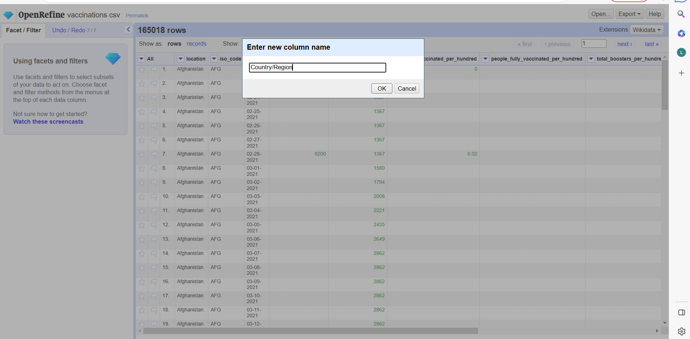
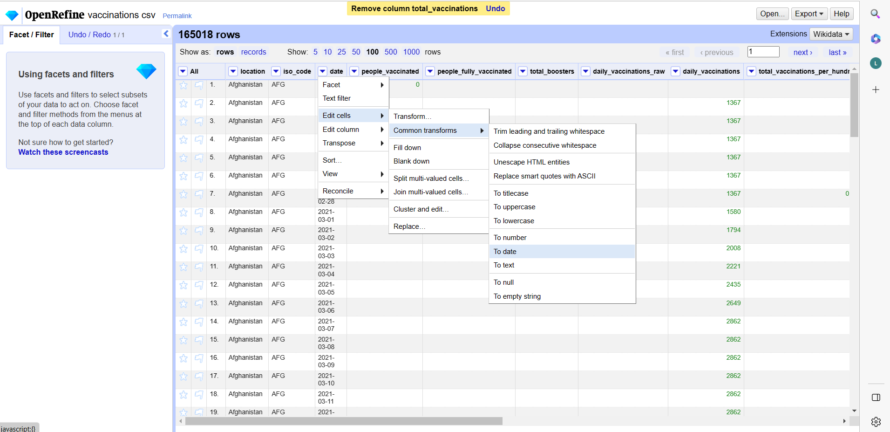

CS 625
================
Sri harshitha K
April 20, 2023

## **Step 1: Choose a Dataset**

COVID-19 is a highly infectious respiratory illness caused by the
SARS-CoV-2 virus. It was first identified in Wuhan, China in December
2019 and has since spread globally, leading to a pandemic.COVID-19
primarily spreads through respiratory droplets when an infected person
talks, coughs, or sneezes. Symptoms of COVID-19 can range from mild to
severe and include fever, cough, fatigue, body aches, loss of smell or
taste, and difficulty breathing. For my project I have taken the
COVID-19 dataset.It contains the first observation date and last update
time of Covid-19 cases and also includes confirmed cases,deaths and
recovered cases in each country.

### *Dataset*

Johns Hopkins University Coronavirus Resource Center: The center
provides real-time updates on COVID-19 cases and deaths globally,
including by country.The dataset includes information on cases and
deaths in various countries around the world, as well as information on
specific regions within those countries. It also includes information on
the number of tests conducted in each country, which can provide
insights into the testing capacity and strategies of different
countries.The dataset can be used for various data analysis and modeling
tasks related to the COVID-19 pandemic, such as forecasting the spread
of the virus, analyzing the impact of interventions and policies, and
identifying patterns and trends in the data.This dataset has daily level
information on the number of affected cases, deaths and recovery from
2019 novel coronavirus. Please note that this is a time series data and
so the number of cases on any given day is the cumulative number.

The dataset contains 306429 rows with 9 columns. There are different
characteristics in the dataset.

- **Sno** - *Serial number*
- **Date** - *Date of the observation in MM/DD/YYYY*
- **Province/State** - *Province or state of the observation (Could be
  empty when missing)*
- **Country/Region** - *Country of observation*
- **Last Update**- *Time in UTC at which the row is updated for given
  province or country*.
- **Confirmed** - *Cumulative number of confirmed cases till that date*
- **Deaths** - *Cumulative number of of deaths till that date*
- **Recovered** - *Cumulative number of recovered cases till that date*

Reference for the dataset source
<https://www.kaggle.com/datasets/sudalairajkumar/novel-corona-virus-2019-dataset>

### *Secondary Dataset*

**The progress of COVID-19 vaccination**

We have selected secondary dataset i.e. The progress of COVID-19
vaccination

The dataset contains information on the progress of COVID-19 vaccination
campaigns worldwide. The data includes information on the number of
doses administered, the type of vaccine used, the percentage of the
population vaccinated, and other related information. This dataset is
updated regularly, and it provides valuable insights into the progress
of vaccination campaigns globally. Researchers and data analysts can use
this dataset to track vaccination progress, identify trends, and make
predictions about future vaccination efforts. The dataset can also be
used to compare vaccination efforts across different countries and
regions. The Secondary dataset contains 165018 rows with 6 columns.
There are different characteristics in the dataset.

- **iso_code** *Country code.*
- **location** *location*
- **date** *date*
- **Total Vaccinations** *This is the absolute number of total
  immunizations in the country*
- **Total no of people fully vaccinated** *This is the number of people
  that received the entire set of immunization according to the
  immunization scheme*
- **daily vaccinations** *daily vaccinations taken place in each region*
- **daily vaccinations per million** *ratio (in ppm) between vaccination
  number and total population for the current date in the country*

*Reference for Covid world vaccination progress
<https://www.kaggle.com/datasets/gpreda/covid-world-vaccination-progress>*

### *Data Manipulations*

We will use our secondary data set i.e., Covid world vaccination
progress to further analyze the pandemic effect on global economy and
study the data to uncover some meaningful insights. The dataset’s
characteristics will be as follows:

- **iso_code** *Categorical*
- **location** *Categorical*
- **date** *date*
- **Total Vaccinations** *Numeric*
- **Total no of people fully vaccinated** *Numeric*
- **Daily vaccinations** *Numeric*
- **daily vaccinationsper million** *Numeric*

For secondary dataset,there are unnecessary fields which we remove in
open refine.

 We rename the column for location as Country /Region to match
it with primary dataset.



And we change the data format same as dataset 1 ,as we use it as unique
id to merge the data with primary dataset. 

 For the data manipulations, as we need specific data with the
two datasets, we are going to use python to alter the data. We are going
to import the data by using the pandas library.

``` r

#To read csv file(data)

import pandas as pd
import numpy as np
#import geopandas as gpd
import seaborn as sns
import matplotlib.pyplot as plt
from shapely.geometry import Point, Polygon

from google.colab import drive
drive.mount('/content/drive')

df = pd.read_csv('/content/drive/My Drive/dataset1.csv')

df2 = pd.read_csv('/content/drive/My Drive/dataset2.csv')

```

``` r

We need to merge the datasets by using date column

#To merge the datasets 


merged_df = pd.merge(df, df2, on ['date'])

merged_df.to_csv('/content/drive/My Drive/dataset.csv', index=False)
```

This is the filtered dataset that we use for this project and to
generate questions.

After dropping null values in open refine ,the final dataset is created.


We came up with two queries concerning the total vaccinations in each
country by date as well as the overall covid death,confirmed,recovered
cases in each country by date, which is comparable to my previous study.
For details on death rates,confirmed, recovered cases by data wise we
use the primary dataset.

In the following phase, we want to expand the exploratory data analysis
with more fascinating data-driven inquiries. Because I also have the
secondary dataset and I integrated the two datasets into one new
dataset, which helps us to get total vaccinations and recovered rate in
each country by data wise.There is a lot of information that can be
shown and utilized to help doctors and educate the general public.Our
major objective is it provides valuable insights into the progress of
vaccination campaigns globally.

The dataset can be used to recovery rates,confirmed, death rates and
compare vaccination across different countries and regions. This can
help identify best practices and strategies for effective vaccination
campaigns, as well as potential areas for improvement.

We have also uploaded our *tableau workbook* for reference. We will thus
come up with the following specific questions using the merged dataset.

### **Question 1: How many Covid 19 cases recovered and vaccinations done across different country ?**


We have used map chart for visualizing the merged dataset to get
meaningful insight.This chart can be used to show the recovery rates and
compare vaccination for each date across different countries/regions.
This can help identify best practices and strategies for effective
vaccination campaigns, as well as potential areas for improvement based
on the recovery rate for each region.And in the above chart United
states has highest vaccination and relatively recorded recovery rate.


For the above data , I created line chart but it is not effective as map
chart.AS Line charts can effectively show how a data point changes over
a period of time. But Map charts can be useful for highlighting
geographic patterns or differences, and can be effective for visualizing
how data varies across different locations.This map chart could be used
to show the distribution of COVID-19 cases across different states or
countries.

### **Question 2: How many Covid 19 cases daily vaccinations per million done and death rate across different country ?**

 In this graph,We use daily vaccinations per million and
death rate recorded across different countries for each date. Bar charts
can also be helpful for comparing the number of cases between different
categories like daily vaccinations per million and death rate in this
case . We can compare the different categories across different
countries by looking at the height of each bar.


We have used scatter plot for daily vaccinations per million and death
rate recorded across different countries for each date.

For this data,bar chart is better compared to scatter plot for better
visualization. In terms of displaying COVID-19 case data, a bar chart
may be more suitable for showing the number of cases in different
countries or regions, as each country or region is a separate category.
A scatter plot is useful for examining the relationship between two
variables, such as the relationship between the number of cases and the
number of tests conducted in a particular country.

### Implementing and Refining Final Chart

### **Final Question: what is the progess rate of vaccinations by year with respect to confirmed and recovery rate ?**

First I have taken the confirmed cases in rows and country in column
row.


In the same way I have added the recovered cases and daily vaccinations
along with the confirmed cases in rows and country in column row.This
visualization display the total number of confirmed and recovered cases
and daily vaccinations done across different countries relatively.

 And I have added the last update in column along with the
country for comparing the total number of confirmed and recovered cases
and daily vaccinations done across different countries for each year.so
that we can get the progress of recovery rate based on the vaccinations
done. This can help identify best practices and strategies for effective
vaccination campaigns, as well as potential areas for improvement based
on the recovery rate for each region.And the progress of no. of
vaccinations and recovery rate in each country.


For this data ,we used bar chart as it demonstrates the various
categories across different countries for each year more efficiently.By
using this data we can get a clear understanding of the progress of
recovery rate relatively to daily vaccinations in each country.From this
chart we can conclude that vaccination rate,confirmed cases and recovery
rate in 2022 are higher compared to 2021 in each country.

## Final Thoughts

Dividing a large project into smaller, more manageable parts is indeed a
great strategy to make the project more manageable and achievable. By
breaking the project down into smaller parts, I focus on each individual
component like data cleaning and data visualizations and worked through
them one at a time, which helped me to work more efficiently on each
part.Additionally,taking the time to create high-quality visualizations
from the raw data sets helped me to get clear insights.Overall, it was a
great approach to tackling this project.

## References

- WHO Covid19, <https://www.who.int/health-topics/coronavirus#tab=tab_1>
- Tableau, <https://www.tableau.com/>
- Dataset,
  <https://www.kaggle.com/datasets/sudalairajkumar/novel-corona-virus-2019-dataset>
- Dataset2,
  <https://www.kaggle.com/datasets/gpreda/covid-world-vaccination-progress>
- Libraries in R,
  <https://cran.r-project.org/web/packages/ggrepel/vignettes/>
- Open Refine, <https://openrefine.org/>
